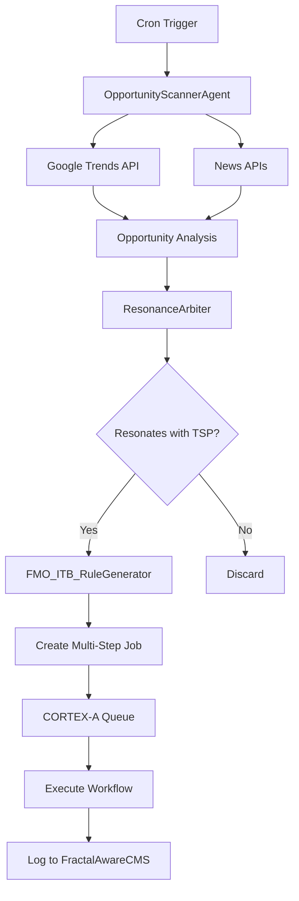

# Introspective Ontology Review: Tenxsom AI Production Readiness

## Core Questions & Analysis

### Question 1: Production Readiness Beyond Mock Replacements

**Q: Will completing the TODOs for mock stubs and instantiating placeholders be everything needed for production-ready status?**

**A: No.** While replacing mocks with functional implementations is necessary, true production readiness requires:

#### Required Beyond Mock Replacement:

1. **Robust Orchestration Layer**
   ```python
   # AIOS_Kernel_Service.py needs:
   class ProductionKernel(AIOS_Kernel):
       def handle_agent_failure(self, agent_id, error):
           # Log to FractalAwareCMS with full context
           css_snapshot = self.capture_cognitive_state()
           self.cms.log_failure(agent_id, error, css_snapshot)
           
           # Decide recovery strategy
           if self.can_retry(agent_id):
               return self.retry_with_backoff(agent_id)
           elif alternative := self.find_alternative_agent(agent_id):
               return self.delegate_to(alternative)
           else:
               return self.graceful_degradation(agent_id)
   ```

2. **Stateful Queue Persistence**
   ```python
   # Implement durable queue
   class PersistentJobQueue:
       def __init__(self, redis_client):
           self.redis = redis_client
           self.recover_pending_jobs()
       
       def enqueue(self, job):
           # Persist to Redis with TTL
           self.redis.zadd('job_queue', {
               job.serialize(): job.priority
           })
       
       def recover_pending_jobs(self):
           # On restart, recover incomplete jobs
           pending = self.redis.zrange('job_queue', 0, -1)
           for job_data in pending:
               self.requeue_if_stale(job_data)
   ```

3. **Real-time Progress Infrastructure**
   ```python
   # WebSocket progress updates
   class ProgressReporter:
       def __init__(self, websocket_server):
           self.ws = websocket_server
       
       async def report_progress(self, job_id, stage, percent, preview=None):
           await self.ws.broadcast(f"job:{job_id}", {
               "stage": stage,
               "percent": percent,
               "preview": preview,
               "timestamp": time.time()
           })
   ```

### Question 2: Autonomous Content Pipeline

**Q: How does the system run autonomously to gather Google Trends data and start the production pipeline?**

**A: Through a choreographed agent system:**

#### Autonomous Pipeline Architecture:

```python
# 1. Scheduled Trigger (cron-like)
class OpportunityScannerAgent(CortexAgent):
    schedule = "0 */6 * * *"  # Every 6 hours
    
    async def execute(self):
        # Gather external signals
        trends = await self.scan_google_trends()
        news = await self.scan_tech_news()
        
        # Package findings
        opportunities = self.analyze_opportunities(trends, news)
        
        # Submit to resonance evaluation
        for opp in opportunities:
            await self.submit_to_arbiter(opp)

# 2. Resonance Evaluation
class ResonanceArbiter:
    def evaluate(self, opportunity):
        # Check against FMO patterns
        fmo_match = self.fmo.find_resonant_patterns(opportunity)
        
        # Evaluate against Target Signature Profiles
        for tsp in self.target_profiles:
            if tsp.matches(opportunity):
                return self.create_directive(opportunity, tsp)
        
        return None

# 3. Directive Generation
class FMO_ITB_RuleGenerator:
    def generate_rule(self, opportunity, tsp):
        return {
            "IF": "trend_resonates_with_tsp",
            "THEN": "create_content_pipeline",
            "BECAUSE": f"aligns_with_{tsp.name}",
            "ACTION": {
                "type": "multi_step_workflow",
                "steps": [
                    {"agent": "ResearchAgent", "task": "deep_dive"},
                    {"agent": "ScriptAgent", "task": "create_narrative"},
                    {"agent": "VideoAgent", "task": "generate_explainer"},
                    {"agent": "AudioAgent", "task": "add_narration"}
                ],
                "metadata": opportunity.to_dict()
            }
        }

# 4. Execution via CORTEX-A
class InternalUpworkSystem:
    async def execute_directive(self, directive):
        job_id = self.create_job(directive)
        
        for step in directive["ACTION"]["steps"]:
            agent = self.get_expert_agent(step["agent"])
            result = await agent.execute(step["task"], job_id)
            
            # Log to CMS
            self.cms.log_step_completion(job_id, step, result)
            
            # Update progress
            await self.progress_reporter.report(job_id, step, result)
```

#### Example Autonomous Flow:



### Question 3: User Priority Handling

**Q: How does it handle prioritizing manual user content inputs?**

**A: Through intelligent preemption with Maxwellian Amplification:**

#### Priority System Implementation:

```python
class PrioritySystem:
    # Priority levels
    PRIORITY_USER_MANUAL = 1.0      # Direct user input
    PRIORITY_USER_DERIVED = 0.8     # User modifications
    PRIORITY_SCHEDULED = 0.4        # Scheduled tasks
    PRIORITY_AUTONOMOUS = 0.2       # Background scanning
    PRIORITY_SYSTEM = 0.1          # Maintenance tasks

class MaxwellianAmplifier:
    def amplify_priority(self, base_priority, context):
        """
        Apply Maxwellian distribution to create probabilistic selection
        that heavily favors high priority while allowing theoretical
        intervention for critical system tasks
        """
        # Base amplification
        amplified = math.exp(base_priority * 10)
        
        # Context modifiers
        if context.get('user_waiting'):
            amplified *= 2.0
        if context.get('system_critical'):
            amplified = max(amplified, 100.0)
        
        return amplified

class CognitiveArbiterEnhanced:
    def select_next_task(self, queue):
        # Get all pending tasks
        tasks = queue.get_pending()
        
        # Calculate selection probabilities
        probabilities = []
        for task in tasks:
            amp_priority = self.amplifier.amplify_priority(
                task.priority,
                task.context
            )
            probabilities.append(amp_priority)
        
        # Normalize to create probability distribution
        total = sum(probabilities)
        probabilities = [p/total for p in probabilities]
        
        # Select task (weighted random)
        selected_idx = numpy.random.choice(
            len(tasks),
            p=probabilities
        )
        
        return tasks[selected_idx]

# Example: User task preemption
async def handle_user_request(request):
    # Tag with high priority
    job = Job(
        type=request.type,
        prompt=request.prompt,
        source='user_manual',
        priority=PRIORITY_USER_MANUAL,
        context={
            'user_waiting': True,
            'user_id': request.user_id,
            'session_id': request.session_id
        }
    )
    
    # Enqueue with amplification
    await queue.enqueue(job)
    
    # Notify arbiter to re-evaluate
    await arbiter.interrupt_current_if_lower_priority(job)

# Derivative claim handling
class DerivativeClaimHandler:
    async def handle_modification_request(self, request):
        # Retrieve original context from CMS
        original = await self.cms.get_by_signature(request.original_id)
        
        # Create high-priority derivative job
        job = Job(
            type='derivative',
            source='user_derived',
            priority=PRIORITY_USER_DERIVED,
            context={
                'original_css': original.cognitive_state,
                'original_tcs': original.temporal_state,
                'modifications': request.modifications,
                'user_waiting': True
            }
        )
        
        await queue.enqueue(job)
```

## Production Readiness Checklist

### Core Systems
- [ ] Replace all mock implementations with real tools
- [ ] Implement robust error handling in AIOS_Kernel
- [ ] Add persistent job queue (Redis/PostgreSQL)
- [ ] Create WebSocket infrastructure for progress
- [ ] Implement resource management system
- [ ] Add comprehensive logging to FractalAwareCMS

### Autonomous Pipeline
- [ ] Deploy OpportunityScannerAgent with scheduler
- [ ] Configure ResonanceArbiter with TSPs
- [ ] Implement FMO_ITB_RuleGenerator
- [ ] Test end-to-end autonomous workflow
- [ ] Add monitoring and alerting

### Priority System
- [ ] Implement MaxwellianAmplifier
- [ ] Configure priority levels
- [ ] Test preemption scenarios
- [ ] Add derivative claim handling
- [ ] Validate user experience

### Resilience
- [ ] Add circuit breakers for external APIs
- [ ] Implement retry logic with backoff
- [ ] Create fallback strategies
- [ ] Add health checks
- [ ] Test failure scenarios

## Conclusion

Production readiness requires not just functional tools, but a robust orchestration layer that can:
1. Handle failures gracefully
2. Manage resources intelligently
3. Run autonomous workflows reliably
4. Prioritize user requests effectively
5. Maintain system health proactively

The architecture is sound, but these operational concerns must be addressed before true production deployment.